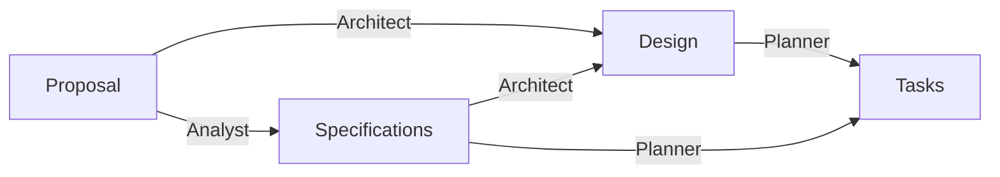

# Agentic Software Engineering Workshop

## Overview

This directory contains the following files:

- `compose.yaml` - Docker Compose file to launch OpenCode container. Inspect it before launching the container.
- `opencode.jsonc` - OpenCode configuration file. Update it as needed, especially to add your specific provider and model configurations. Also see [OpenCode config documentation](https://opencode.ai/docs/config/).
- `agents/` - Agent definitions and permissions. See [OpenCode agents documentation](https://opencode.ai/docs/agents/).
- `workspace/` - A directory containing sample project artifacts based on [a previously vibe-coded project](https://github.com/aadityabhatia/usma-class-timer). See README.md and proposal.md for more details. Replace them if you have another project in mind.

> [!TIP]
> Ask your friends with self-hosted LLMs for their OpenCode configuration files.

## Getting Started

1. On Windows, Install Docker, git, and WSL. Docker will automatically use WSL as its backend.

```sh
# install git and docker in your Windows environment, not in WSL
winget install Git.Git Docker.DockerDesktop

# Verify that you have WSL 2
wsl --version

# if not present, run `wsl` in PowerShell as admin to install
wsl

# if already installed, try updating
wsl --update

# reboot if needed
```

After installing Docker and WSL, open Docker Desktop and start the Docker Engine. This uses WSL as a backend.

> [!NOTE]
> On any other OS, just ensure that you have `git` and `docker` available.


2. Clone this repository. Update the configuration file as needed.

```sh
git clone ...
cd ...
```

3. Launch OpenCode container: `docker compose up -d`

> [!TIP]
> To stop a detached container, run `docker compose down --remove-orphans`. Check container status by running `docker compose ps` in the same directory or `docker ps` anywhere.

4. Open http://localhost:4096 in your browser

5. Under OpenCode Settings
    - `Show Reasoning Summaries`
    - `Expand shell tool parts`
    - Advanced > `Show agent`

6. Add your token providers to `opencode.jsonc`. You can also do this via the GUI later on. [Mistral](https://console.mistral.ai/) and [Poolside](https://platform.poolside.ai/) provide free access. Opt out of data collection if the provider allows.

> [!TIP]
> Most self-hosted providers provide an OpenAI-compatible API endpoint. OpenCode allows you to add any OpenAI-compatible provider from the UI. These URLs typically end in `/v1`. To get a list of models available from your provider, open the provider URL in a browser and append `/v1/models` to the end of the URL.

> [!WARNING]
> Many free models available by default in OpenCode retain and use your data for training. Also ensure that you are authorized to use the specific models beforehand. Use the `Manage Models` setting to disable models that you do not intend to use.

7. Add the project folder `/workspace` to your OpenCode interface. You can also mount and use other folders as needed- see `compose.yaml`.

8. Create a new session and start interacting with various agents. Select your preferred model. Add providers and models as needed. Some agents have more permissions than others. See [OpenCode permissions documentation](https://opencode.ai/docs/permissions/).

## Proposed Agentic Workflow



### Artifacts

- Proposal describes the problem, scope, and user intent. It answers the why and what.
- Specifications include functional and non-functional requirements, constraints, and risks. It answers the what and how.
- Design describes the system architecture, data flow, interfaces, and dependencies. It answers the how.
- Tasks are a concrete, ordered implementation checklist -- backlog of work items with clear completion criteria.

### Agents

- LessonPrep - Reviewer: Review lesson materials for consistency and errors
- SoftwareDevelopment - Analyst: Translate user intent and proposal into a clearly defined set of specifications including functional and non-functional requirements, constraints, and risks
- SoftwareDevelopment - Architect: Convert proposal and specifications into a workable technical design
- SoftwareDevelopment - Planner: Convert design and specifications into an executable implementation plan
- SoftwareDevelopment - Technical Manager: oversee project execution; chunk
- SoftwareDevelopment - Developer: Implement code, run commands, write unit tests, run lint/typecheck, investigate errors, and debug
- SoftwareDevelopment - Reviewer: Review correctness, clarity, maintainability, and requirement alignment
- SoftwareDevelopment - Tester: Design and execute unit, integration and end-to-end tests; validate test quality and coverage of required behavior

> [!NOTE]
> Agent filenames are prefixed with the workflow name so OpenCode’s flat selector stays alphabetized by workflow first, then role.

## References

- [OpenCode](https://opencode.ai/)
- [github.com/aadityabhatia/agents-opencode](https://github.com/aadityabhatia/agents-opencode)
- [Mistral Small 4 / Medium 3.5](https://docs.mistral.ai/models/overview)
- [Poolside Laguna XS 2.1](https://poolside.ai/blog/introducing-laguna-xs-2-1)
